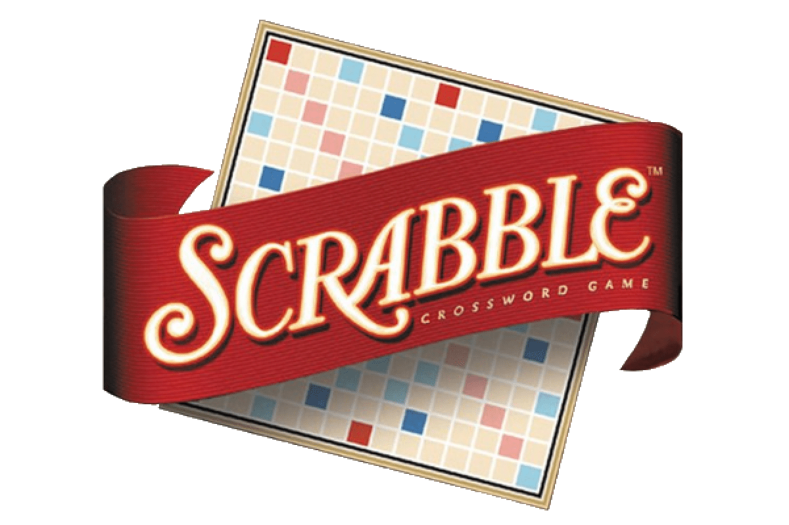

# Data Scientist 

#### Technical Skills: Python, SQL, R/Rstudio, Tableau, Excel, Power BI, Snowflake

#### Analytical Skills: Supervised Learning, Unsupervised Learning, Deep Learning, Scikit-learn, TensorFlow, Reinforcement Learning, NLP, A/B Testing, Causal Analysis, Time Series Analysis, Statistical Analysis, Stremlit, and Data Visualization 

### Education
- Master of Science in Business Analytics, Carlson School of Management at the University of Minnesota | (_May 2024_)

- Bachelor of Science in Business Analytics, Herbert Business School at the University of Miami | (_May_ 2023)

### Work Experience 
**Data Scientist @ Internal Revenue Service (_Oct. 2024 - Feb. 2025_)** 
- Developed the first data-driven methodology and report utilized by Senior Staff to assess work efficiency across multiple departments, identifying key strengths and areas of improvement to drive strategic decision-making. 
- Enhanced daily processes by automating SQL and Python queries, increasing efficiency by up to 10x and reducing manual workload.  
- Delivered in-depth analysis through data visualizations in Python, PowerPoint, and Power BI, providing actionable insights to evaluate and optimize current work processes. 

**Analytics Student Consultant @ Carlson Analytics Lab (_June 2023 - May 2024_)** 
- Collaborated on 4 client projects within 10 months working with a government agency, a publicschool board, an educational testing company, and a financial literacy nonprofit organization. 
- Developed automated process and predictive model for government client to identify individuals committing tax fraud, resulting in an improved process over 10 times faster with 87% accuracy.
- Created K-Protypes mode using SQL and Python for nonprofit organization that identified most successful individuals, increasing precise marketing by 25%.
- Identified, linked, cleaned, and merged multiple large data sources, of up to 8M-records, for the purpose of segmenting and classifying customers.
- Organized projects as the Product Owner by leveraging Agile project management methodology and utilizing organizational tools such as Jira. 

**Data Scientist @ ABM Industries (_May 2022 - August 2022_)** 
- Utilized Tableau to produce reports for senior leadership on vulnerability in employee retention and presented business recommendations to lower attrition rate by 13%.
- Developed methodologies with Data Science team to predict employee attrition rate by using dataset containing close to 60 variables. 
- Built XGBoost model in Python and identified factors related to employee attrition.

**Data Analyst Intern @ Institutional Research and Stategic Analytics Department at the University of Miami (_June 2021 - January 2022_)** 
- Pinpointed areas of improvement for school rank based on data consisting of 100+ features.
- Devised a competitive analysis, gathered insights, and designed recommendations based on 
market analysis consisting of comparable schools.
- Executed a SWOT analysis aimed to uncover areas for possible improvements in rankings based 
off dataset consisting of 2,000+ schools.

## Projects 

<a href="https://job-applications-tracker.streamlit.app/">Job Application Tracking Dashboard</a>
<a href="https://github.com/jdevrao19/Job_Application_Tracker/tree/main">Job Application Tracking Repository</a>

### Description
This project was designed to be a organized way to track job applications and visualize results. 
The dashboard utilizes the Streamlit app package in Python along with a SQL Snowflake database. Any user can go in and add records, edit existing records, and delete records in real time. 
  
---------------------------------------

<a href="https://github.com/jdevrao19/Insurance_Claims_ML">Insurance Claim Prediction</a>

### Description
Our project was an in-depth exploration of the daily tasks performed by insurance companies. The goal was to develop a model that could predict with a high degree of accuracy whether or not an insurance company's clients were likely to file a claim based on numerous factors.
  
---------------------------------------

<a href="https://github.com/jdevrao19/Kaggle-Scrabble_Predicting_Player_Ratings">Scrabble Player Rating Prediction </a>

### Description 
In this project, based on Woogle.io datasets we are tasked with finding the rating of human players before a game is played. The games are between the bots and human users. We will be using metadata about the games and specific information about the turns in each game to predict the rating of the human opponents. The rating provided from our model will be evaluated by RMSE.
Our project was an in-depth exploration of the daily tasks performed by insurance companies. The goal was to develop a model that could predict with a high degree of accuracy whether or not an insurance company's clients were likely to file a claim based on numerous factors.
